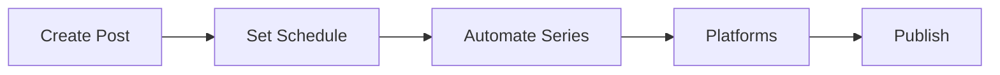

## Overview

Runway Social Studio equips you with powerful tools to manage social media for multifamily properties. You create engaging content, schedule posts across platforms, track performance with analytics, and boost resident interaction using tailored strategies. These features streamline your workflow, helping property managers showcase amenities and build community.

<Columns cols={2}>
  <Card title="Content Tools" icon="edit-3" href="#content-creation">
    Design custom posts with templates optimized for apartments.
  </Card>
  <Card title="Scheduling" icon="calendar" href="#scheduling">
    Automate posting to Facebook, Instagram, and more.
  </Card>
  <Card title="Analytics" icon="bar-chart-3" href="#analytics">
    Measure engagement and ROI with detailed reports.
  </Card>
  <Card title="Engagement" icon="users" href="#engagement">
    Use proven templates to connect with residents.
  </Card>
</Columns>

## Content Creation and Customization Tools

You start by accessing the content editor in Runway Social Studio. Drag-and-drop elements like images of pool areas or gym facilities, add text overlays, and apply brand colors such as `#f1d8e0`. Customize with property-specific details, ensuring posts highlight unique amenities.

<Callout kind="tip">
  Upload high-resolution photos of your multifamily community to maximize visual impact.
</Callout>

<Steps>
  <Step title="Select Template" icon="layout">
    Choose from resident event or amenity showcase templates.
  </Step>
  <Step title="Customize Content" icon="edit">
    Add text like "Join our rooftop yoga this Saturday!" and resize images.
  </Step>
  <Step title="Preview Post" icon="eye">
    View how it appears on Instagram and Facebook feeds.
  </Step>
  <Step title="Save Draft" icon="save">
    Store for later scheduling.
  </Step>
</Steps>

## Scheduling and Automation Workflows

Automate your social calendar to post consistently. Connect accounts once, then queue content for optimal times based on resident activity peaks.



<Tabs>
  <Tab title="Instagram" icon="instagram">
    Schedule Stories and Reels for daily resident tips.
  </Tab>
  <Tab title="Facebook" icon="facebook">
    Post events to community groups with auto-reminders.
  </Tab>
  <Tab title="LinkedIn" icon="linkedin">
    Share industry updates for property owners.
  </Tab>
</Tabs>

## Analytics and Performance Tracking

Monitor post effectiveness with built-in dashboards. Track likes, shares, and comments to refine strategies. Export reports to share with property owners.

<CodeGroup tabs="JavaScript,Python">
  ```javascript
  // Fetch analytics via API
  const response = await fetch('https://api.example.com/v1/analytics?propertyId=12345', {
    headers: { Authorization: `Bearer ${YOUR_API_KEY}` }
  });
  const data = await response.json();
  console.log(data.engagementRate);
  ```
  ```python
  # Fetch analytics via API
  import requests
  response = requests.get(
      'https://api.example.com/v1/analytics?propertyId=12345',
      headers={'Authorization': f'Bearer {YOUR_API_KEY}'}
  )
  data = response.json()
  print(data['engagementRate'])
  ```
</CodeGroup>

| Metric | Description | Target for Multifamily |
|--------|-------------|------------------------|
| Engagement Rate | Likes + comments / reach | `>5%` |
| Reach | Unique users seeing post | `>80%` of residents |
| Click-Through | Link clicks / impressions | `>2%` |

## Resident Engagement Strategies and Templates

Drive interaction with ready-to-use templates for events, polls, and testimonials. Personalize to mention resident spotlights or maintenance updates.

<ExpandableGroup>
  <Expandable title="Event Promotion Template" default-open="true">
    Use this for open houses:

    ```
    🎉 Join our [Event Name] on [Date]!
    Location: [Amenity]
    RSVP: Link in bio
    #MultifamilyLiving #ResidentEvents
    ```

    Boost attendance by 30% on average.
  </Expandable>
  <Expandable title="Poll for Feedback">
    Sample poll: "What's your favorite community amenity? A) Pool B) Gym C) Clubhouse"
  </Expandable>
</ExpandableGroup>

<Callout kind="success">
  Start with one post per day across platforms to build momentum.
</Callout>