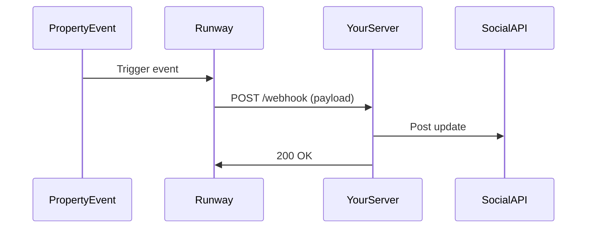

## Overview

Runway Social Studio integrates seamlessly with property management software, social platforms, and custom APIs. You connect these tools to automate content posting, receive real-time resident updates, and enhance your property's online presence. Start with official integrations for quick setup, then explore webhooks and APIs for advanced workflows.

<Columns cols={3}>
  <Card title="Property Management" icon="database" href="#property-management">
    Sync resident data and amenities from tools like Yardi or AppFolio.
  </Card>
  <Card title="Webhooks" icon="zap" href="#webhooks">
    Get instant notifications for lease renewals or maintenance requests.
  </Card>
  <Card title="Social Platforms" icon="share-2" href="#social-platforms">
    Native connections to Facebook, Instagram, and Twitter.
  </Card>
</Columns>

## Property Management Software

Link Runway Social Studio with leading property management systems to pull in community events, amenities, and resident feedback automatically. Supported platforms include Yardi, RealPage, and AppFolio.

<Callout kind="tip">
  Check your property management dashboard for Runway Social Studio's OAuth app to enable single-click authorization.
</Callout>

Follow these steps to connect:

<Steps>
  <Step title="Authorize Access" icon="key">
    Log in to your property management portal and navigate to Integrations > Runway Social Studio. Click `Authorize`.
  </Step>
  <Step title="Select Data Sources" icon="filter">
    Choose data types like `resident_events`, `amenities`, and `feedback`.
  </Step>
  <Step title="Test Connection" icon="check-circle">
    Run a sync test to verify data flows to your social content calendar.
  </Step>
</Steps>

## Webhooks for Real-Time Updates

Set up webhooks to receive push notifications when property events occur, such as new move-ins or community events. This keeps your social feeds fresh without manual checks.

First, create a webhook endpoint on your server. Use this example payload structure:

<CodeGroup tabs="Node.js,Python">
  ```javascript
  const express = require('express');
  const app = express();
  app.use(express.json());

  app.post('/webhook/runway', (req, res) => {
    const event = req.body;
    if (event.type === 'resident_movein') {
      console.log(`New resident: ${event.resident.name}`);
      // Post to social media
    }
    res.status(200).send('OK');
  });

  app.listen(3000);
  ```
  ```python
  from flask import Flask, request, jsonify
  app = Flask(__name__)

  @app.route('/webhook/runway', methods=['POST'])
  def webhook():
      event = request.json
      if event['type'] == 'resident_movein':
          print(f"New resident: {event['resident']['name']}")
          # Post to social media
      return jsonify({'status': 'OK'}), 200

  if __name__ == '__main__':
      app.run(port=3000)
  ```
</CodeGroup>

<ParamField path="webhook_url" param-type="string" required="true">
  Your public endpoint URL, e.g., `https://your-server.com/webhook/runway`.
</ParamField>

<ParamField header="X-Runway-Signature" param-type="string" required="false">
  HMAC signature for verifying webhook authenticity. Compute using your secret key.
</ParamField>

In Runway Social Studio dashboard:

1. Go to Settings > Webhooks > New Webhook.
2. Enter your `{webhook_url}` and select events like `lease_renewal` or `maintenance_request`.
3. Save and test.



## Social Platform Integrations

Connect directly to major social networks for scheduled posting and analytics.

<Tabs>
  <Tab title="Facebook & Instagram" icon="facebook">
    Use Meta Business Suite integration:
    
    <Request tabs="cURL">
      ```bash
      curl -X POST https://api.example.com/v1/integrations/meta \
        -H "Authorization: Bearer YOUR_API_KEY" \
        -H "Content-Type: application/json" \
        -d '{
          "account_id": "your-meta-account-id",
          "pages": ["property-page-1", "property-page-2"]
        }'
      ```
    </Request>
  </Tab>
  <Tab title="Twitter (X)" icon="twitter">
    Authorize via Twitter Developer Portal:
    
    <Request tabs="JavaScript">
      ```javascript
      const response = await fetch('https://api.example.com/v1/integrations/twitter', {
        method: 'POST',
        headers: { 'Authorization': 'Bearer YOUR_API_KEY' },
        body: JSON.stringify({
          consumer_key: 'your-consumer-key',
          account: '@YourPropertyHandle'
        })
      });
      ```
    </Request>
  </Tab>
</Tabs>

## Custom API Connections

For advanced users, use Runway Social Studio's REST API to build custom integrations.

<Response tabs="200">
  ```json
  {
    "success": true,
    "data": {
      "posts": [
        {
          "id": "post_123",
          "content": "New amenity opening at Oakwood Properties!",
          "platforms": ["facebook", "instagram"]
        }
      ]
    }
  }
  ```
</Response>

<Callout kind="alert">
  Always use HTTPS for API calls and rotate your `{API_KEY}` regularly for security.
</Callout>

<Expandable title="API Rate Limits" default-open="false">
  - `{100}` requests per minute for standard plans
  - `{1000}` for enterprise
  - Exceeding limits returns `429 Too Many Requests`
</Expandable>

Explore the full API reference for endpoints like `/v1/posts` and `/v1/properties`.